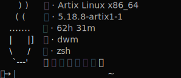

<h1 align="center">
    <br>
    
    <br>
    cfetch
    <br>
</h1>

<h4 align="center">A blazing fast fetch program written in <a href="https://www.open-std.org/JTC1/SC22/WG14/www/standards" target="_blank">C</a>.</h4>

<p align="center">
<a href="./LICENSE"></a>
<a href="https://www.buymeacoffee.com/gabrielzschmitz" target="_blank"></a>
<a href="https://github.com/gabrielzschmitz/cfetch"></a>
</p>

<p align="center">
  <a href="#how-to-install">How to Install</a> •
  <a href="#how-to-use">How to Use</a> •
  <a href="#fetch-capabilities">Fetch Capabilities</a> •
  <a href="#dependencies">Dependencies</a> •
  <a href="#thanks-to">Thanks to</a>
</p>

## How to Install
<b>Note</b>: a good practice is to clone the repo at <i>$HOME/.local/src/</i>.
```
$ git clone https://github.com/gabrielzschmitz/cfetch.git
$ cd cfetch
$ sudo make
```

## How to Use
```
$ cfetch
```

To run it everytime you open a terminal you can call it at your shell config:
```
$ echo "cfetch" >> $HOME/.bashrc
$ echo "cfetch" >> $HOME/.zshrc
$ echo "cfetch" >> $HOME/.config/fish/config.fish
```

## Fetch Capabilities
It can <b>fetches</b>:
<i>
 * Distribution
 * Kernel
 * Uptime
 * Window Manager 
 * Shell
 * Terminal Colors
</i>

## Dependencies
<b>Note</b>: only compatible with [<b>linux</b>](https://www.linuxfoundation.org/).
<i>
* [gcc](https://gcc.gnu.org/)
* [xorg](https://www.x.org/wiki/)
* [xlibwrap](https://github.com/matyklug18/Flexfetch/blob/master/xlibwrap.h) (included in the repo)
<i/>

## Thanks to
- [<b>matyklug18</b>](https://github.com/matyklug18/Flexfetch) - By creating the base for that program

