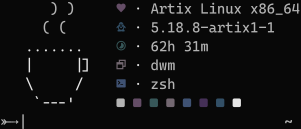

<h1 align="center">
    <br>
    
    <br>
    cfetch
    <br>
</h1>

<h4 align="center">A blazing fast fetch program written in <a href="https://www.open-std.org/JTC1/SC22/WG14/www/standards" target="_blank">C</a>.</h4>

<p align="center">
<a href="./LICENSE"></a>
<a href="https://www.buymeacoffee.com/gabrielzschmitz" target="_blank"></a>
<a href="https://github.com/gabrielzschmitz/cfetch"></a>
</p>

<p align="center">
  <a href="#how-to-install">How to Install</a> •
  <a href="#how-to-use">How to Use</a> •
  <a href="#fetch-capabilities">Fetch Capabilities</a> •
  <a href="#thanks-to">Thanks to</a> •
</p>

## How to Install

```
$ git clone https://github.com/gabrielzschmitz/cfetch.git
$ cd
$ sudo /usr/share/cfetch
$ sudo cp coffee.art /usr/share/cfetch/coffee.art
$ make
```

<b>Note</b>: change the path in the <b><i>mv</i></b> command at Makefile to your <b>$PATH</b>, default is<b> $HOME/.local/bin/</b>.

## How to Use

```
$ cfetch
```

## Fetch Capabilities

It can <b>fetches</b>:
<i>
 * Distribution
 * Kernel
 * Uptime
 * Window Manager 
 * Shell
 * Terminal Colors
</i>

## Thanks to

- [<b>matyklug18</b>](https://github.com/matyklug18/Flexfetch) - By creating the base for that program

